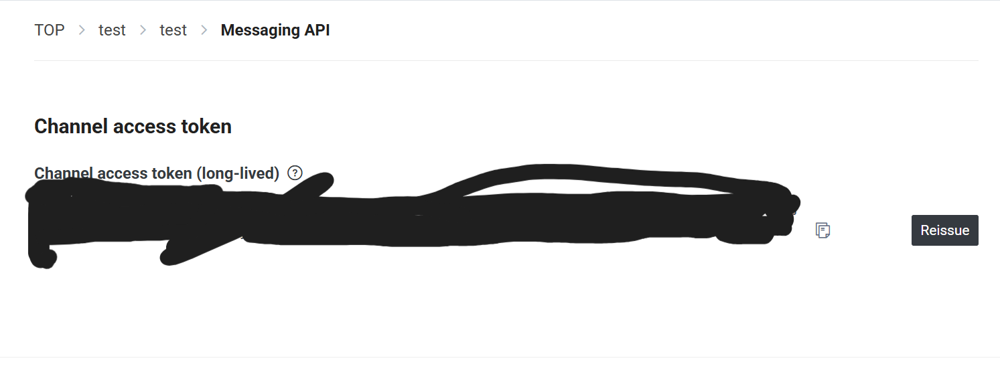

# Line Messaging API Docs

## https://developers.line.biz/en/docs/messaging-api/

## Line Configuration

### 1. login to line dev console

    - Need to sign up for Line Business Id

### 2. Create Provider

### 3. Inside Provider, Create Messaging API Channel

### 4. Create Line Official Account

### 5. Go to Line Official Account Manager (settings/messaging-api) and enable Messaging API

### 6. Issue Channel Access Token

## Next.js Integration (App Router)

### 1. Create webhook-handler (api/webhook-handlers/line/route.ts)

### 2. Publically expose local url using ngrok

### 3. Configure line webhook url to send webhooks to the ngrok url

### profit
